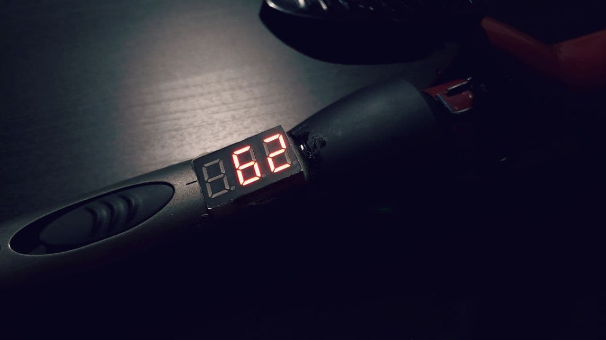
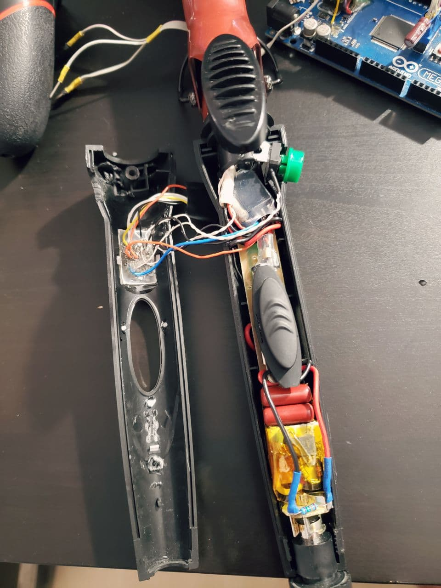
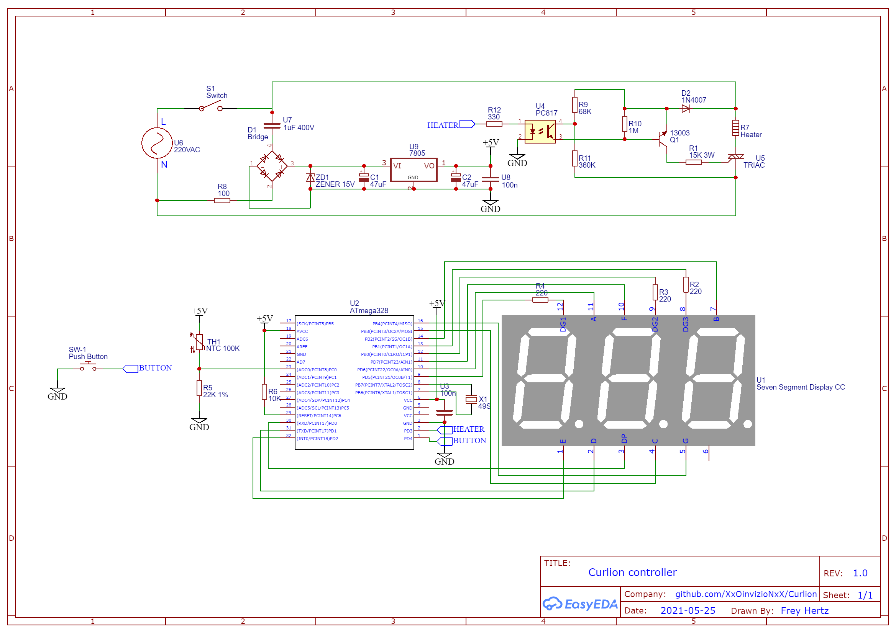

# Curlion

----------

This project is a temperature controller for a hair curler. With the ability to adjust the required temperature and hold it.

This project was developed for my own needs. The project has no real meaning and is made just for fun :)

**Curl**ing + **i**r**on** = **CURLION** 

----------

----------

## Feedback
- Developer: Fern Lane
- E-Mail: xxoinvizionxx@gmail.com
- GitHub: https://github.com/F33RNI
- Twitter: https://twitter.com/f33rni

----------

## Dependencies

- **SevSeg** (Seven-segment-display controller): https://github.com/DeanIsMe/SevSeg

----------

## Description and schematic

### ATTENTION! THE SCHEMATIC MAY CONTAIN MISTAKES, BECAUSE COMPOSED FROM MEMORY AFTER ASSEMBLING THE PROJECT 🙂

The project was based on an unnecessary hair curling iron. Inside the handle is a seven-segment display, an ATmega328, a transformerless power supply (with a capacitor) and a TRIAC controlled via an optocoupler with NPN transistor so that only half of the mains sine wave is supplied to the heater.

To measure the temperature, a 100K NTC thermistor (from an old laptop battery) was glued into the inside of the heating pipe

After turning on, the curling iron will ask you to press a button (works as a fuse). After that, the set temperature lights up on the display for a few seconds. 
Then, there are 2 modes:
- Heating mode
- Setting mode

Switching by long press on the button.

In heating mode, the difference between the set and current temperature is calculated and fed to the input of the PD-controller. If the output of the PD-controller is greater than 1.0, a signal is sent to the optocoupler to turn on the heater. When the heater is working, DP at the last segment is illuminated.

In the setting mode (blinking setting temperature), by pressing the button, the desired temperature can be selected.

